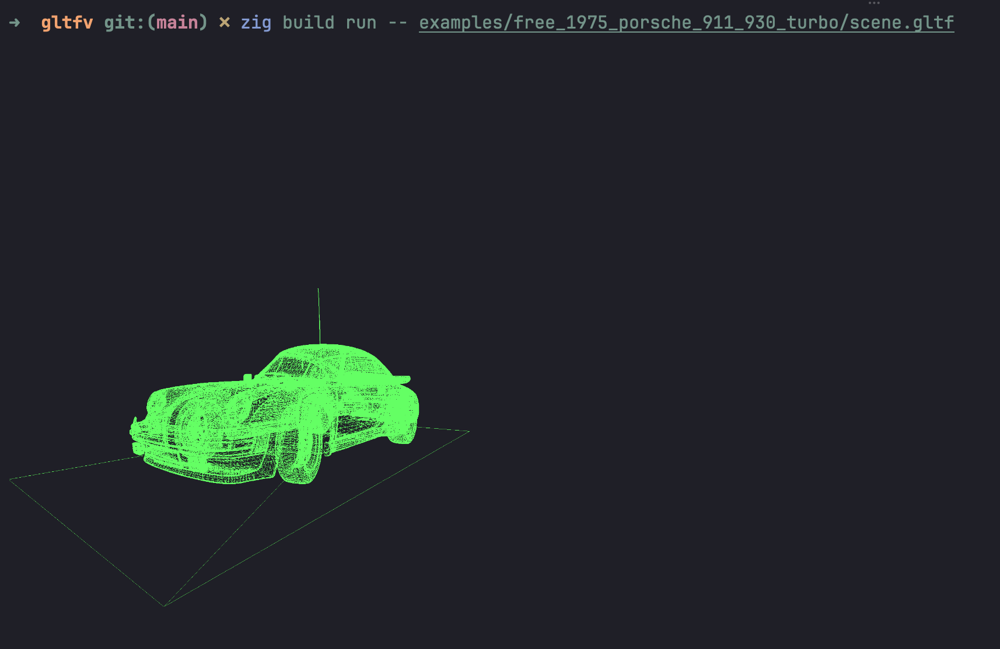

# glTF Viewer for the terminal

Renders glTF models (so far just the wireframe) to the terminal using the [Kitty graphics protocol](https://sw.kovidgoyal.net/kitty/graphics-protocol)

[zgltf](https://github.com/kooparse/zgltf/) is used for parsing the glTF models

